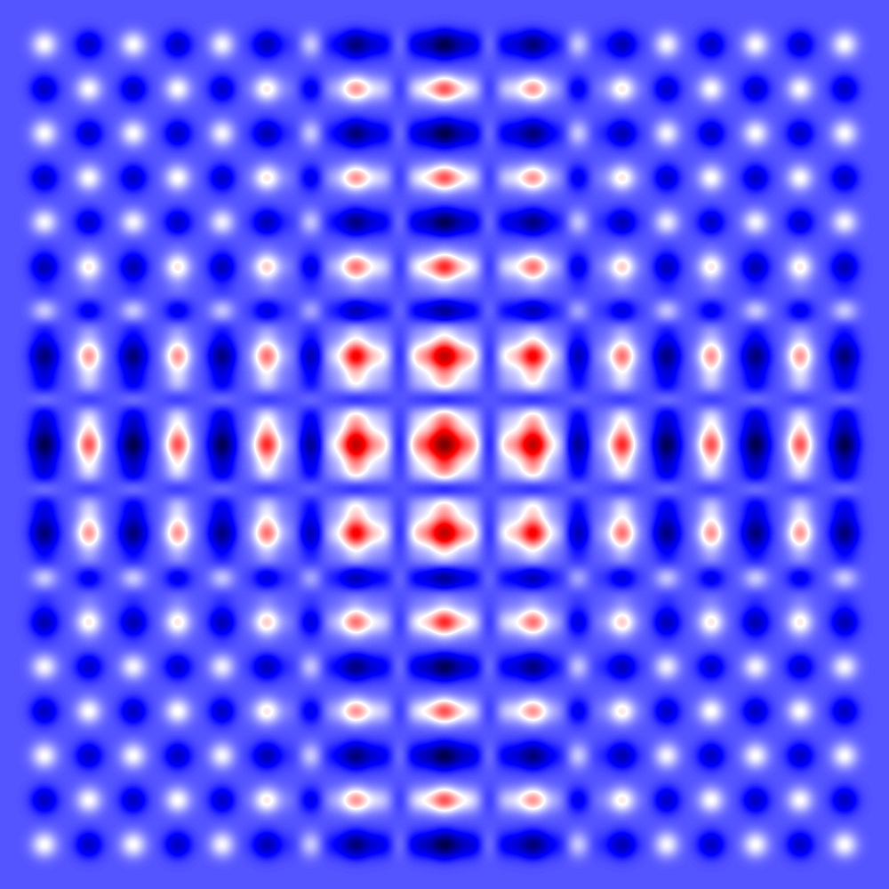

# notebooks
some jupyter notebooks for different topics I like. The image processing is the most advanced one.

## Python notebooks
* Image processing
    * RGB K-means clusterization
    * Transferring image paletes
    * Getting sky gradient
    
    * Plotting gaussian Kernels
    
    
* Text processing
* Computing

## Julia notebooks
* Dynamic systems modelling(armonic oscillators)
